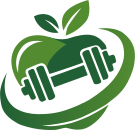

<h1>
   Cimientos
</h1>

Track the few things that actually matter if you want to change your body: calories, protein, and training.

Live app: https://cimientos.app

This is a full-stack TypeScript project I am building around a simple idea: most fitness apps ask for too much, show too much, and make consistency harder than it needs to be. I wanted the opposite. Something focused, fast, and opinionated.

## 🧱 What this project is

Cimientos is a nutrition-first fitness tracker built with Next.js and a Clean Architecture core.

Right now, the app is centered on:

- user registration and login
- weekly meal planning
- recipe creation and management
- ingredient search by name and barcode
- a dashboard focused on the current day

There is also workout-related domain and application logic in the codebase, because I want food and training to live in the same product instead of pretending they are separate problems.

## 🎯 Why I built it

I care a lot about physical health, long-term progress, and tools that remove friction instead of adding it.

When I started taking nutrition seriously, I ran into the same problem over and over again: logging food was slow, noisy, and mentally expensive. Most apps felt like data warehouses. I do not want a data warehouse. I want a tool that helps me stay consistent.

That is the idea behind this project.

## Install instructions

Installs each repo with their own dependencies for avoiding react version conflicts between apps.

```bash
npm run install-app
```
