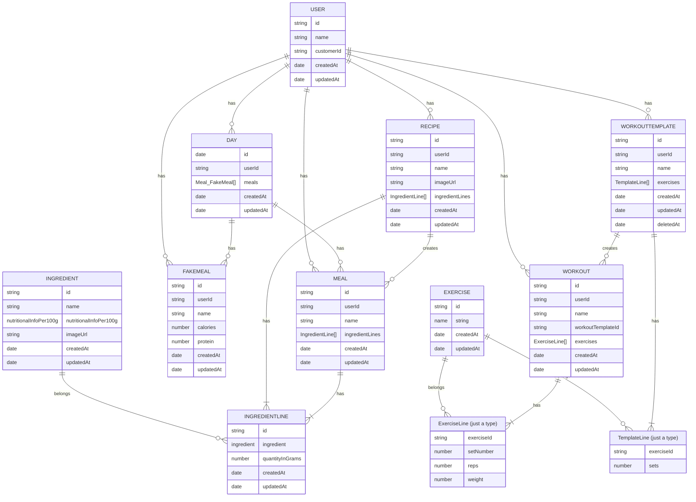

```mermaid
erDiagram
    DAY {
      date id
      string userId
      Meal_FakeMeal[] meals
      date createdAt
      date updatedAt
    }
    EXERCISE {
      string id
      name string
      date createdAt
      date updatedAt
    }
    EXERCISELINE["ExerciseLine (just a type)"] {
      string exerciseId
      number setNumber
      number reps
      number weight
    }
    FAKEMEAL {
      string id
      string userId
      string name
      number calories
      number protein
      date createdAt
      date updatedAt
    }
    INGREDIENT {
      string id
      string name
      nutritionalInfoPer100g nutritionalInfoPer100g
      string imageUrl
      date createdAt
      date updatedAt
    }
    INGREDIENTLINE {
      string id
      ingredient ingredient
      number quantityInGrams
      date createdAt
      date updatedAt
    }
    MEAL {
      string id
      string userId
      string name
      IngredientLine[] ingredientLines
      date createdAt
      date updatedAt
    }
    RECIPE {
      string id
      string userId
      string name
      string imageUrl
      IngredientLine[] ingredientLines
      date createdAt
      date updatedAt
    }
    USER {
      string id
      string name
      string customerId
      date createdAt
      date updatedAt
    }
    WORKOUT {
      string id
      string userId
      string name
      string workoutTemplateId
      ExerciseLine[] exercises
      date createdAt
      date updatedAt
    }
    TEMPLATELINE["TemplateLine (just a type)"] {
      string exerciseId
      number sets
    }
    WORKOUTTEMPLATE {
      string id
      string userId
      string name
      TemplateLine[] exercises
      date createdAt
      date updatedAt
      date deletedAt
    }

  USER ||--o{ DAY : has
  USER ||--o{ FAKEMEAL : has
  USER ||--o{ MEAL : has
  USER ||--o{ RECIPE : has
  USER ||--o{ WORKOUT : has
  USER ||--o{ WORKOUTTEMPLATE : has

  DAY ||--o{ FAKEMEAL : has
  DAY ||--o{ MEAL : has

  INGREDIENT ||--o{ INGREDIENTLINE : belongs

  RECIPE ||--|{ INGREDIENTLINE : has
  RECIPE ||--o{ MEAL : creates

  MEAL ||--|{ INGREDIENTLINE : has

  EXERCISE ||--o{ EXERCISELINE : belongs

  WORKOUT ||--|{ EXERCISELINE : has

  EXERCISE ||--o{ TEMPLATELINE : belongs

  WORKOUTTEMPLATE ||--o{ WORKOUT : creates
  WORKOUTTEMPLATE ||--|{ TEMPLATELINE : has

```
